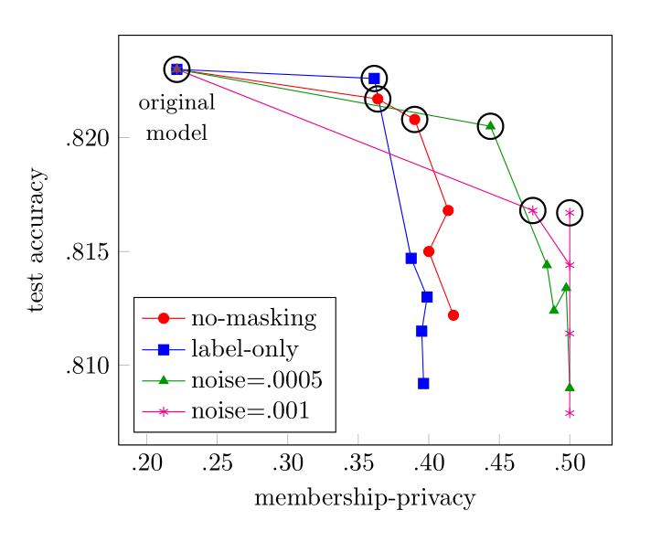

# RepKD - Repeated Knowledge Distillation

<!-- **NOTE**
This repository is still in active development.

--- -->

RepKD is a tool that enhances the privacy of machine learning models. It applies the repeated knowledge distillation strategy described in [[1]](https://dl.acm.org/doi/abs/10.1145/3560830.3563721) to mitigate potential privacy attacks. If you use our repository, please [cite us](#how-to-cite-repkd). The tool assesses the privacy of a model against two membership inference attacks: black-box [[2]](https://ieeexplore.ieee.org/stamp/stamp.jsp?arnumber=7958568), and white-box [[3]](https://ieeexplore.ieee.org/stamp/stamp.jsp?arnumber=8835245). The library provides some example cases in the ```test``` folder.

RepKD takes a trained input model and applies several rounds of knowledge distillation with masked labeling. The models crafted this way are then tested against membership inference attacks and their utility-privacy tradeoff is thus determined. You can finally choose which resulting model better fit your needs.



## Usage

Install the local project with

```
pip install -e .
```

Then you can find the knowledge distillation building block in ```repkd/kd.py```, and the template for the repeated KD in the test folder, e.g. ```test/MLP_MNIST/exp_repkd.py```.

## References

1. Mazzone et al. [Repeated Knowledge Distillation with Confidence Masking to Mitigate Membership Inference Attacks](https://dl.acm.org/doi/abs/10.1145/3560830.3563721) in Proceedings of the 15th ACM Workshop on Artificial Intelligence and Security, 2022.
2. Shokri et al. [Membership inference attacks against machine learning models](https://ieeexplore.ieee.org/stamp/stamp.jsp?arnumber=7958568) in IEEE symposium on security and privacy, 2017.
3. Nasr et al. [Comprehensive privacy analysis of deep learning: Passive and active white-box inference attacks against centralized and federated learning](https://ieeexplore.ieee.org/stamp/stamp.jsp?arnumber=8835245) in IEEE symposium on security and privacy, 2019.

## How to Cite RepKD

To cite RepKD in academic papers, please use the following BibTeX entry.

```
@inproceedings{mazzone2022repeated,
  title={Repeated Knowledge Distillation with Confidence Masking to Mitigate Membership Inference Attacks},
  author={Mazzone, Federico and van den Heuvel, Leander and Huber, Maximilian and Verdecchia, Cristian and Everts, Maarten and Hahn, Florian and Peter, Andreas},
  booktitle={Proceedings of the 15th ACM Workshop on Artificial Intelligence and Security},
  pages={13--24},
  year={2022}
}
```

## Contributors

* Federico Mazzone
* Leander van den Heuvel
* Maximilian Huber
* Cristian Verdecchia

## Acknowledgments

This work is part of a project that has received funding from the European Union’s Horizon 2020 research and innovation programme under grant agreement No 965315.
